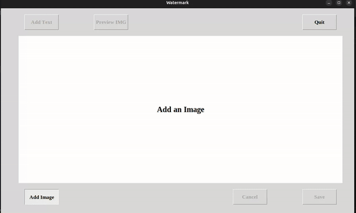

# Watermark App

A watermarking application built in Python using Tkinter for the GUI and PIL (Pillow) for image processing. This app allows users to add customizable text as a watermark to images, with adjustable positioning, color, font, and preview features.

## Features

- **Add Text**: Insert custom text as a watermark and configure its properties.
- **Preview Mode**: View how the watermark will appear before saving.
- **Font Customization**: Choose from various font families, colors, and sizes.
- **Drag and Move Text**: Position the watermark by dragging it across the image.
- **Save and Cancel Options**: Save the final image with the watermark or cancel changes.
- **Image Background**: Load an image to serve as the canvas for watermarking.
  
## Installation

1. Clone this repository:
   ```bash
   git clone https://github.com/yourusername/Watermark-App.git
   ```
2. Navigate to the project directory:
   ```bash
   cd Watermark-App
   ```
3. Install required dependencies:
   ```bash
   pip install -r requirements.txt
   ```

## Usage

1. Run the application:
   ```bash
   python ui.py
   ```
2. Select an image to load as the canvas.
3. Use the "Add Text" button to open a window to customize watermark properties.
4. Drag and position the watermark on the image.
5. Preview the watermark, then save the image.

## Folder Structure

- **main.py**: Entry point for the application.
- **ui.py**: Main file with the GUI and application logic.
- **Fonts/**: Directory containing custom fonts for watermark text.
- **assets/**: Directory for storing images and other resources.
  
## How to Add Text

1. Click **Add Text** to open the text customization window.
2. Enter your text, select a font, color, and size.
3. Press **Apply** to view the text on the image.
4. You can reposition the text by dragging it across the image.

## How to Save Image

1. Click **Save**.
2. Enter a filename in the popup window.
3. Choose a save location, and the image will be saved with the watermark.


## Project Demo

Below is a demonstration of the application in action. The GIF showcases the watermarking features and how users can add text to images effectively.




